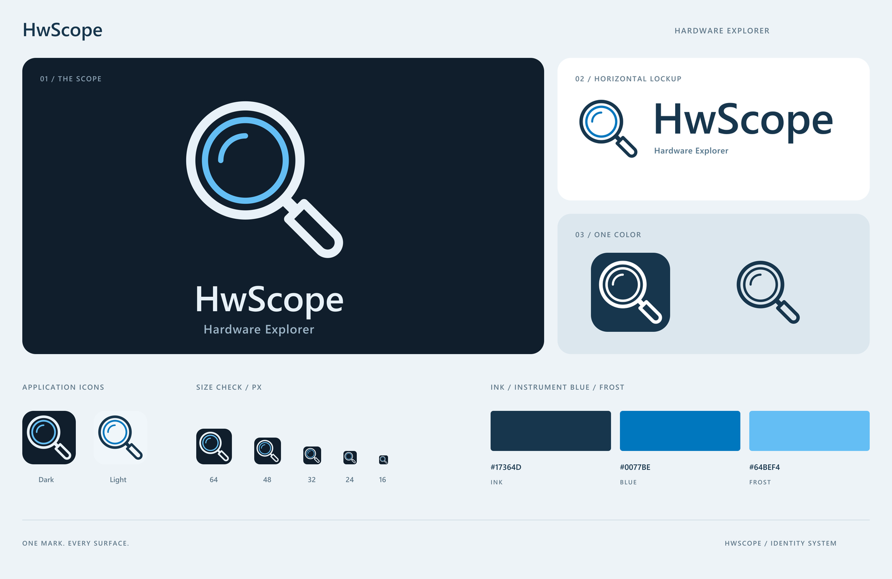

# HwScope 品牌图标

基于原有放大镜图标重绘：保留双层镜圈、左上反光弧和右下 45° 手柄，统一线宽、比例和安全留白。深墨色表达硬件工具的稳重感，仪器蓝强调观察与检测。资源组织参考本地 MIDI Play 项目的品牌套件。



## 文件选择

| 文件 | 用途 |
| --- | --- |
| `hwscope-icon.svg` / `hwscope-icon-light.svg` | 不带文字的方形应用 Logo，深色 / 浅色圆角底板，512 × 512 |
| `hwscope-lockup.svg` / `hwscope-lockup-light.svg` | 带 HwScope 字标与 Hardware Explorer 副标的横版 Logo，适配深色 / 浅色背景，透明底，1000 × 256 |
| `hwscope-mark.svg` / `hwscope-mark-light.svg` | 不带底板的独立标志，适配深色 / 浅色背景，透明底，512 × 512 |
| `hwscope-mark-ink.svg` / `hwscope-mark-white.svg` | 深墨色 / 白色单色标志，透明底 |
| `hwscope-icon-small.svg` / `hwscope-icon-small-light.svg` | 16～24 像素专用图形，保留双镜圈与手柄，省去最内侧反光弧 |
| `hwscope.ico` | Windows 多尺寸图标，11 个 32-bit RGBA 图层 |
| `png/` | 上述标志的透明 PNG、深浅色应用图标和横版组合 |
| `hwscope-preview.png` / `.svg` | 完整设计展示和小尺寸对照 |

PNG 应用图标提供 16、20、24、32、48、64、72、80、96、128、256、512、1024 像素，深浅两套。独立标志为 1024 × 1024，横版为 2000 × 512。ICO 包含 16～256 像素的全部 11 个尺寸。

## 配色与排版

| 角色 | 深色底版本 | 浅色底版本 |
| --- | --- | --- |
| 镜框与字标 | `#E8F1F8` | `#17364D` |
| 内镜圈与反光弧 | `#64BEF4` | `#0077BE` |
| 应用图标底板 | `#101E2C` | `#F0F6FA` |

字标保留项目的大小写 `HwScope`，下方配以 `Hardware Explorer` 英文副标。以 Segoe UI Semibold 为基础调整间距后转为路径。全部 SVG（包括展示板文字）均不依赖字体、外链图片或滤镜，镜内和手柄内的留白为透明镂空。

## 使用规范

- 方形 Logo 不添加文字；横版标准组合使用 HwScope 字标与 Hardware Explorer 副标。
- 深色表面使用主版或白色单色版；浅色表面使用 `-light` 或 `-ink` 版。
- 保持纵横比、双圈结构、45° 手柄方向及配色关系，不拉伸或填实镂空。
- 独立标志建议 32 像素及以上；16～24 像素优先使用已导出的应用图标。
- 带副标横版建议至少 360 像素宽；更小的空间使用无字标图形，避免副标过小。
- SVG 画板已包含安全留白；排版时至少再保留一条外镜圈线宽的周边间距。

## 应用接入与重新导出

`src/HwScope.App/Assets/HwScope.ico` 与本目录的 `hwscope.ico` 保持一致。项目现有 `ApplicationIcon`、主窗口和预加载窗口继续引用该路径，重新构建即可更新 EXE 及窗口图标。系统可能缓存旧图标；本套件不修改系统图标缓存设置。

矢量 SVG 是可编辑源文件。修改后可使用 Node.js 和 `sharp` 重新导出 PNG / ICO：

```powershell
node scripts/export-branding.cjs
```

在已有工具环境中，可将 `HWSCOPE_SHARP_MODULE` 指向现有 `sharp` 模块目录，避免向应用工程添加依赖。导出脚本会同时更新品牌目录和 App 中的 ICO。PNG 采用 4 倍超采样后缩小；小尺寸自动选择专用图形。
